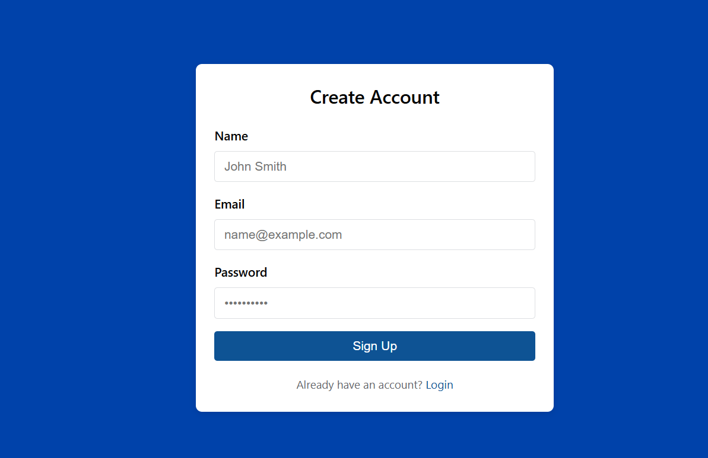
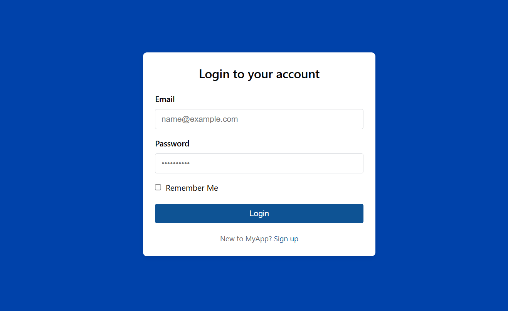
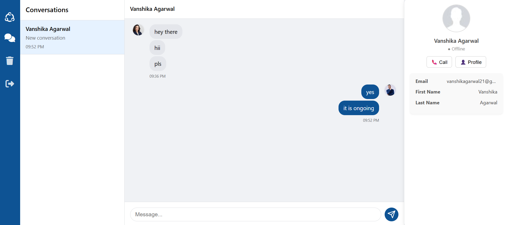

# 📩 FHelpDesk - Facebook Messenger Helpdesk App

FHelpDesk is a full-stack helpdesk solution that integrates with Facebook Messenger to enable businesses to connect their pages, manage customer conversations in real time, and respond directly from a centralized dashboard.

---

## 🌐 Live Demo

- **Frontend:** [https://f-help-desk-hfqh.vercel.app/](https://f-help-desk-hfqh.vercel.app/)
- **Backend:** [https://fhelpdesk.onrender.com](https://fhelpdesk.onrender.com)

> Note: Facebook page integration only works if the app is in **Live Mode** or you are added as a **tester**.

---

## 🔧 Features

- 🔐 Facebook Login & Page Token Exchange
- 🔄 Connect Multiple Facebook Pages
- 💬 View and Respond to Messages in Real Time
- 📡 Socket.io-based Live Updates
- 🧠 JWT-based Authentication
- 💾 MongoDB Atlas for Storage
- 📥 Webhook Integration with Facebook

---

## 🧱 Tech Stack

| Frontend       | Backend        | Database       | Others               |
|----------------|----------------|----------------|----------------------|
| React.js       | Express.js     | MongoDB Atlas  | Facebook Graph API   |
| Axios          | Node.js        | Mongoose       | Socket.io            |
| Tailwind CSS   | JWT Auth       |                | Vercel + Render      |

---

## 📁 Folder Structure

```

/client        → React frontend
/app           → Express backend
/models        → Mongoose models
/utils         → Facebook SDK & socket utils
/routes        → API routes

````

---

## 🚀 Getting Started

### 🔧 Prerequisites

- Node.js
- Facebook Developer Account
- MongoDB Atlas Cluster

---

### 🔁 Clone the Repo

```bash
git clone https://github.com/Vanshikaaga/FHelpDesk.git
cd FHelpDesk
````

---

### 📦 Environment Setup

#### Backend (`.env`):

```env
PORT=5000
MONGODB_URI=your_mongo_atlas_uri
FB_WEBHOOK_VERIFY_TOKEN=your_fb_webhook_token
JWT_SECRET=your_jwt_secret
```

#### Frontend (`client/.env`):

```env
REACT_APP_API_URL=https://fhelpdesk.onrender.com
REACT_APP_FB_APP_ID=your_facebook_app_id
```

---

### 🧪 Run Locally

#### Backend

```bash
cd app
npm install
npm run dev
```

#### Frontend

```bash
cd client
npm install
npm start
```

---

## 🛠️ Facebook App Configuration

### 1. Add Webhook URL

In your [Facebook App Dashboard](https://developers.facebook.com/):

* Go to **Messenger > Webhooks**
* Add Callback URL:
  `https://fhelpdesk.onrender.com/api/fb/webhook`
* Add Verify Token (same as `.env`)
* Subscribe to `messages` and `messaging_postbacks`

### 2. Add Tester to App

Go to **Roles > Testers** and add your Facebook account so it works in development.

---

## 🧪 Testing

1. Go to the website and log in with Facebook.
2. Connect a Facebook page.
3. Send a message to the page via Messenger.
4. Check the dashboard to see the conversation.
5. Data will be saved in MongoDB Atlas under the correct collections.

---

## 📷 Screenshots

> Make sure to replace these paths with your own screenshots.

### 💬 Register Panel



### ✅ Login Page



### 📊 Dashboard




---

## 🛠️ Deployment

* **Frontend** deployed on [Vercel](https://vercel.com)
* **Backend** deployed on [Render](https://render.com)
* **Database** hosted on [MongoDB Atlas](https://cloud.mongodb.com)

---

## ❗ Known Issues

* `401 manifest.json` → Fixed by skipping token on static files in Axios config
* `JSSDK unknown host domain` → Make sure to add Vercel domain in Facebook App → Settings → Basic
* Webhooks not working? → Check Facebook webhook logs and app permissions

---

## 🔒 Privacy Policy

For demo/testing purposes, you can use a placeholder:
[https://example.com/privacy](https://example.com/privacy)

---

## 📬 Contact

**Vanshika Agarwal**
📧 [vanshikagarwal21@gmail.com](mailto:vanshikagarwal21@gmail.com)

---

## 📜 License

This project is licensed under the MIT License.

```

---

Let me know if you'd like:
- A downloadable `.md` file
- Screenshot placeholders added for deployment
- Badges (CI/CD, deployment, license) added to the top

I'll be happy to assist.
```
